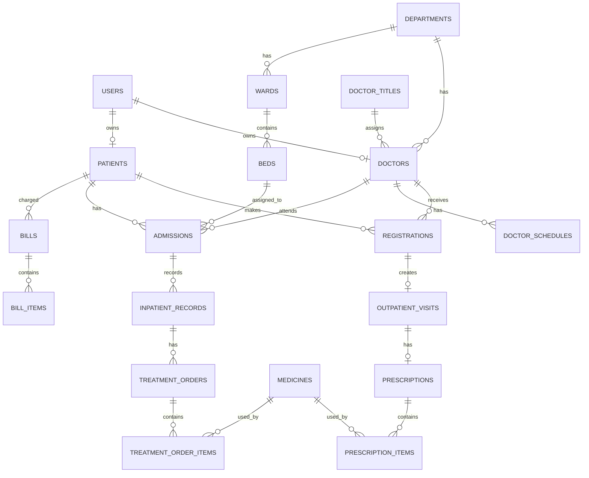

# 医院管理信息系统数据库设计文档

## 1. 设计背景

本设计基于 `doc/2026《数据库系统原理与实践》综合设计实验指导书.docx`，面向 MySQL 数据库实现医院管理信息系统。系统业务范围包括门诊治疗、住院治疗、药品信息维护、线上缴费与统计查询；不涉及医疗检查、手术治疗和药房发药业务流程。

## 2. 设计目标

- 支持管理员维护科室、医生、病人、药品、病房、病床等基础数据。
- 支持医生查看排班、接诊病人、开具门诊处方和住院诊疗方案。
- 支持病人挂号、缴费、就诊、查询自己的就诊记录和费用明细。
- 支持住院建档、病床安排、每日住院记录、住院计费和出院记录。
- 支持统计不同科室的排班情况、不同医生的工作量情况、病人的治疗情况。

## 3. 设计原则

- 使用统一 `users` 表管理登录账号，通过角色区分管理员、医生、病人。
- 本课程实验中密码按明文存储，字段命名为 `password`。
- 不使用数据库物理外键，所有关联关系通过业务字段和应用层逻辑维护。
- 门诊和住院业务分开建模，但共享医生、病人、科室、药品等基础表。
- 费用统一由账单和账单明细表达，账单状态只区分未支付和已支付。
- 药品价格、医生诊疗费等费用信息在业务明细中保留快照，避免后续价格变动影响历史记录。

## 4. 功能模块

### 4.1 账号与角色模块

| 表名 | 说明 |
|---|---|
| `users` | 登录账号，保存用户名、明文密码、角色和账号状态。 |

角色取值：

- `ADMIN`：管理员
- `DOCTOR`：医生
- `PATIENT`：病人

### 4.2 基础资料模块

| 表名 | 说明 |
|---|---|
| `departments` | 科室信息。 |
| `doctor_titles` | 医生职称及默认诊疗费。 |
| `doctors` | 医生资料，每位医生只属于一个科室。 |
| `patients` | 病人资料。 |
| `medicines` | 药品信息与库存。 |

### 4.3 门诊模块

| 表名 | 说明 |
|---|---|
| `doctor_schedules` | 医生排班，区分门诊坐诊与住院巡诊。 |
| `registrations` | 病人挂号记录。 |
| `outpatient_visits` | 门诊就诊记录。 |
| `prescriptions` | 门诊处方主表。 |
| `prescription_items` | 门诊处方用药明细。 |

### 4.4 住院模块

| 表名 | 说明 |
|---|---|
| `wards` | 病房信息，隶属于科室。 |
| `beds` | 病床信息，隶属于病房。 |
| `admissions` | 住院档案，表示一次住院历史。 |
| `inpatient_records` | 每日住院记录，保存病情和诊疗方案摘要。 |
| `treatment_orders` | 住院诊疗方案或住院处方。 |
| `treatment_order_items` | 住院诊疗方案用药明细。 |

### 4.5 费用模块

| 表名 | 说明 |
|---|---|
| `bills` | 费用单，可关联门诊、住院或处方。 |
| `bill_items` | 费用明细。 |

## 5. 核心业务关系

以下是逻辑关系说明，不表示数据库中创建物理外键。

## 6. 主要约束

### 6.1 科室、医生、病人

- 一个科室可以有多名医生。
- 一名医生只属于一个科室。
- 医生职称决定默认诊疗费，实际门诊处方会保存当次诊疗费快照。
- 医生和病人都可以绑定一个登录账号。
- 逻辑关联字段不建立物理外键，数据一致性由应用层维护。

### 6.2 排班

- 医生排班分为：门诊坐诊 `OUTPATIENT`、住院巡诊 `INPATIENT_ROUND`。
- 同一医生在同一时间段不能同时安排门诊和住院巡诊。
- 时间段冲突由应用层校验。

### 6.3 门诊

- 病人先挂号，再形成门诊就诊记录。
- 复诊可以选择原医生，也可以选择其他医生。
- 一个门诊就诊记录最多关联一张处方。
- 处方明细保存药品、单价、数量、用法。
- 处方状态只区分 `UNPAID` 和 `PAID`。
- 无库存药品不应出现在处方明细中，该规则由应用层校验，并在开方成功后扣减库存。

### 6.4 住院

- 一位病人可以多次住院，每次住院生成一条住院档案。
- 一条住院档案只属于一位病人。
- 每次住院安排一个科室、一位主治医生和一个病床。
- 一个病床可以有多次历史住院记录，但同一时间只能被一个未出院病人占用。
- 每次住院每天至少可生成一条住院记录，记录病情描述和诊疗方案摘要。
- 住院档案不记录预缴金额，费用统一通过账单模块表达。

### 6.5 费用

- 门诊费用、处方费用、住院床位费、住院治疗费都统一进入账单。
- 一个账单包含多条费用明细。
- 账单状态只区分 `UNPAID` 和 `PAID`。
- 不单独设置支付记录表，支付结果直接体现在账单状态中。

## 7. 表结构设计

### 7.1 `users` 登录账号表

| 字段 | 类型 | 约束 | 说明 |
|---|---|---|---|
| `id` | BIGINT | PK | 用户 ID |
| `username` | VARCHAR(50) | UNIQUE, NOT NULL | 登录名 |
| `password` | VARCHAR(100) | NOT NULL | 明文密码 |
| `role` | ENUM | NOT NULL | `ADMIN` / `DOCTOR` / `PATIENT` |
| `status` | ENUM | NOT NULL | `ACTIVE` / `DISABLED` |
| `created_at` | DATETIME | NOT NULL | 创建时间 |
| `updated_at` | DATETIME | NOT NULL | 更新时间 |

### 7.2 `departments` 科室表

| 字段 | 类型 | 约束 | 说明 |
|---|---|---|---|
| `id` | BIGINT | PK | 科室 ID |
| `name` | VARCHAR(100) | UNIQUE, NOT NULL | 科室名称 |
| `location` | VARCHAR(100) |  | 科室位置 |
| `created_at` | DATETIME | NOT NULL | 创建时间 |
| `updated_at` | DATETIME | NOT NULL | 更新时间 |

### 7.3 `doctor_titles` 医生职称表

| 字段 | 类型 | 约束 | 说明 |
|---|---|---|---|
| `id` | BIGINT | PK | 职称 ID |
| `name` | VARCHAR(50) | UNIQUE, NOT NULL | 职称名称 |
| `consultation_fee` | DECIMAL(10,2) | NOT NULL | 默认诊疗费 |

### 7.4 `doctors` 医生表

| 字段 | 类型 | 约束 | 说明 |
|---|---|---|---|
| `id` | BIGINT | PK | 医生 ID |
| `user_id` | BIGINT | UNIQUE | 登录账号 ID |
| `department_id` | BIGINT | NOT NULL | 所属科室 ID |
| `title_id` | BIGINT | NOT NULL | 职称 ID |
| `employee_no` | VARCHAR(50) | UNIQUE, NOT NULL | 工号 |
| `name` | VARCHAR(50) | NOT NULL | 姓名 |
| `gender` | ENUM | NOT NULL | 性别 |
| `phone` | VARCHAR(30) |  | 电话 |
| `created_at` | DATETIME | NOT NULL | 创建时间 |
| `updated_at` | DATETIME | NOT NULL | 更新时间 |

### 7.5 `patients` 病人表

| 字段 | 类型 | 约束 | 说明 |
|---|---|---|---|
| `id` | BIGINT | PK | 病人 ID |
| `user_id` | BIGINT | UNIQUE | 登录账号 ID |
| `medical_record_no` | VARCHAR(50) | UNIQUE, NOT NULL | 病案号 |
| `name` | VARCHAR(50) | NOT NULL | 姓名 |
| `gender` | ENUM | NOT NULL | 性别 |
| `phone` | VARCHAR(30) |  | 电话 |
| `address` | VARCHAR(255) |  | 地址 |
| `created_at` | DATETIME | NOT NULL | 创建时间 |
| `updated_at` | DATETIME | NOT NULL | 更新时间 |

### 7.6 `medicines` 药品表

| 字段 | 类型 | 约束 | 说明 |
|---|---|---|---|
| `id` | BIGINT | PK | 药品 ID |
| `code` | VARCHAR(50) | UNIQUE, NOT NULL | 药品编码 |
| `name` | VARCHAR(100) | NOT NULL | 药品名称 |
| `specification` | VARCHAR(100) |  | 规格 |
| `unit` | VARCHAR(20) | NOT NULL | 单位 |
| `unit_price` | DECIMAL(10,2) | NOT NULL | 当前单价 |
| `stock_quantity` | INT | NOT NULL | 库存数量 |
| `status` | ENUM | NOT NULL | `ACTIVE` / `DISABLED` |
| `created_at` | DATETIME | NOT NULL | 创建时间 |
| `updated_at` | DATETIME | NOT NULL | 更新时间 |

### 7.7 `doctor_schedules` 医生排班表

| 字段 | 类型 | 约束 | 说明 |
|---|---|---|---|
| `id` | BIGINT | PK | 排班 ID |
| `doctor_id` | BIGINT | NOT NULL | 医生 ID |
| `department_id` | BIGINT | NOT NULL | 科室 ID |
| `schedule_type` | ENUM | NOT NULL | `OUTPATIENT` / `INPATIENT_ROUND` |
| `start_time` | DATETIME | NOT NULL | 开始时间 |
| `end_time` | DATETIME | NOT NULL | 结束时间 |
| `room` | VARCHAR(50) |  | 诊室或巡诊地点 |
| `created_at` | DATETIME | NOT NULL | 创建时间 |

### 7.8 `registrations` 挂号表

| 字段 | 类型 | 约束 | 说明 |
|---|---|---|---|
| `id` | BIGINT | PK | 挂号 ID |
| `patient_id` | BIGINT | NOT NULL | 病人 ID |
| `doctor_id` | BIGINT | NOT NULL | 医生 ID |
| `department_id` | BIGINT | NOT NULL | 科室 ID |
| `schedule_id` | BIGINT |  | 对应排班 ID |
| `visit_type` | ENUM | NOT NULL | `FIRST` / `FOLLOW_UP` |
| `registered_at` | DATETIME | NOT NULL | 挂号时间 |
| `status` | ENUM | NOT NULL | `REGISTERED` / `VISITED` / `CANCELLED` |

### 7.9 `outpatient_visits` 门诊就诊表

| 字段 | 类型 | 约束 | 说明 |
|---|---|---|---|
| `id` | BIGINT | PK | 就诊 ID |
| `registration_id` | BIGINT | UNIQUE, NOT NULL | 挂号记录 ID |
| `patient_id` | BIGINT | NOT NULL | 病人 ID |
| `doctor_id` | BIGINT | NOT NULL | 医生 ID |
| `symptom_description` | TEXT |  | 症状描述 |
| `diagnosis` | TEXT |  | 诊断意见 |
| `visited_at` | DATETIME | NOT NULL | 就诊时间 |

### 7.10 `prescriptions` 门诊处方表

| 字段 | 类型 | 约束 | 说明 |
|---|---|---|---|
| `id` | BIGINT | PK | 处方 ID |
| `visit_id` | BIGINT | UNIQUE, NOT NULL | 门诊就诊 ID |
| `doctor_id` | BIGINT | NOT NULL | 开方医生 ID |
| `patient_id` | BIGINT | NOT NULL | 病人 ID |
| `consultation_fee` | DECIMAL(10,2) | NOT NULL | 当次诊疗费 |
| `medicine_amount` | DECIMAL(10,2) | NOT NULL | 药品总额 |
| `total_amount` | DECIMAL(10,2) | NOT NULL | 总金额 |
| `status` | ENUM | NOT NULL | `UNPAID` / `PAID` |
| `created_at` | DATETIME | NOT NULL | 创建时间 |

### 7.11 `prescription_items` 门诊处方明细表

| 字段 | 类型 | 约束 | 说明 |
|---|---|---|---|
| `id` | BIGINT | PK | 明细 ID |
| `prescription_id` | BIGINT | NOT NULL | 处方 ID |
| `medicine_id` | BIGINT | NOT NULL | 药品 ID |
| `medicine_name` | VARCHAR(100) | NOT NULL | 药品名称快照 |
| `unit_price` | DECIMAL(10,2) | NOT NULL | 单价快照 |
| `quantity` | INT | NOT NULL | 数量 |
| `usage_instruction` | VARCHAR(255) |  | 用法 |
| `amount` | DECIMAL(10,2) | NOT NULL | 小计 |

### 7.12 `wards` 病房表

| 字段 | 类型 | 约束 | 说明 |
|---|---|---|---|
| `id` | BIGINT | PK | 病房 ID |
| `department_id` | BIGINT | NOT NULL | 所属科室 ID |
| `ward_no` | VARCHAR(50) | UNIQUE, NOT NULL | 病房编号 |
| `location` | VARCHAR(100) | NOT NULL | 位置 |
| `daily_charge` | DECIMAL(10,2) | NOT NULL | 每日床位收费标准 |

### 7.13 `beds` 病床表

| 字段 | 类型 | 约束 | 说明 |
|---|---|---|---|
| `id` | BIGINT | PK | 病床 ID |
| `ward_id` | BIGINT | NOT NULL | 所属病房 ID |
| `bed_no` | VARCHAR(50) | NOT NULL | 床位号 |
| `status` | ENUM | NOT NULL | `AVAILABLE` / `OCCUPIED` / `MAINTENANCE` |

约束：同一病房内床位号唯一。

### 7.14 `admissions` 住院档案表

| 字段 | 类型 | 约束 | 说明 |
|---|---|---|---|
| `id` | BIGINT | PK | 住院档案 ID |
| `admission_no` | VARCHAR(50) | UNIQUE, NOT NULL | 住院号 |
| `patient_id` | BIGINT | NOT NULL | 病人 ID |
| `department_id` | BIGINT | NOT NULL | 住院科室 ID |
| `attending_doctor_id` | BIGINT | NOT NULL | 主治医生 ID |
| `bed_id` | BIGINT | NOT NULL | 病床 ID |
| `admitted_at` | DATETIME | NOT NULL | 入院时间 |
| `discharged_at` | DATETIME |  | 出院时间 |
| `status` | ENUM | NOT NULL | `ACTIVE` / `DISCHARGED` / `SUSPENDED` |

### 7.15 `inpatient_records` 住院记录表

| 字段 | 类型 | 约束 | 说明 |
|---|---|---|---|
| `id` | BIGINT | PK | 记录 ID |
| `admission_id` | BIGINT | NOT NULL | 住院档案 ID |
| `record_date` | DATE | NOT NULL | 记录日期 |
| `condition_description` | TEXT | NOT NULL | 病情描述 |
| `treatment_summary` | TEXT | NOT NULL | 诊疗方案摘要 |
| `doctor_id` | BIGINT | NOT NULL | 记录医生 ID |
| `created_at` | DATETIME | NOT NULL | 创建时间 |

约束：同一住院档案同一天最多一条住院记录。

### 7.16 `treatment_orders` 住院诊疗方案表

| 字段 | 类型 | 约束 | 说明 |
|---|---|---|---|
| `id` | BIGINT | PK | 诊疗方案 ID |
| `inpatient_record_id` | BIGINT | NOT NULL | 住院记录 ID |
| `doctor_id` | BIGINT | NOT NULL | 开具医生 ID |
| `description` | TEXT | NOT NULL | 治疗方法描述 |
| `treatment_fee` | DECIMAL(10,2) | NOT NULL | 治疗费用 |
| `created_at` | DATETIME | NOT NULL | 创建时间 |

### 7.17 `treatment_order_items` 住院用药明细表

| 字段 | 类型 | 约束 | 说明 |
|---|---|---|---|
| `id` | BIGINT | PK | 明细 ID |
| `treatment_order_id` | BIGINT | NOT NULL | 诊疗方案 ID |
| `medicine_id` | BIGINT | NOT NULL | 药品 ID |
| `medicine_name` | VARCHAR(100) | NOT NULL | 药品名称快照 |
| `unit_price` | DECIMAL(10,2) | NOT NULL | 单价快照 |
| `quantity` | INT | NOT NULL | 数量 |
| `usage_instruction` | VARCHAR(255) |  | 用法 |
| `amount` | DECIMAL(10,2) | NOT NULL | 小计 |

### 7.18 `bills` 费用单表

| 字段 | 类型 | 约束 | 说明 |
|---|---|---|---|
| `id` | BIGINT | PK | 账单 ID |
| `bill_no` | VARCHAR(50) | UNIQUE, NOT NULL | 账单号 |
| `patient_id` | BIGINT | NOT NULL | 病人 ID |
| `source_type` | ENUM | NOT NULL | `OUTPATIENT` / `INPATIENT` |
| `source_id` | BIGINT | NOT NULL | 来源业务 ID |
| `total_amount` | DECIMAL(10,2) | NOT NULL | 应付金额 |
| `status` | ENUM | NOT NULL | `UNPAID` / `PAID` |
| `created_at` | DATETIME | NOT NULL | 创建时间 |
| `updated_at` | DATETIME | NOT NULL | 更新时间 |

### 7.19 `bill_items` 费用明细表

| 字段 | 类型 | 约束 | 说明 |
|---|---|---|---|
| `id` | BIGINT | PK | 明细 ID |
| `bill_id` | BIGINT | NOT NULL | 账单 ID |
| `item_type` | ENUM | NOT NULL | `CONSULTATION` / `MEDICINE` / `BED` / `TREATMENT` |
| `item_name` | VARCHAR(100) | NOT NULL | 费用名称 |
| `unit_price` | DECIMAL(10,2) | NOT NULL | 单价 |
| `quantity` | DECIMAL(10,2) | NOT NULL | 数量 |
| `amount` | DECIMAL(10,2) | NOT NULL | 小计 |

## 8. 索引设计

| 表 | 索引 | 目的 |
|---|---|---|
| `users` | `username` 唯一索引 | 登录查询 |
| `doctors` | `employee_no` 唯一索引 | 工号查询 |
| `doctors` | `department_id` | 按科室查询医生 |
| `patients` | `medical_record_no` 唯一索引 | 病案号查询 |
| `medicines` | `code` 唯一索引 | 药品编码查询 |
| `doctor_schedules` | `(doctor_id, start_time, end_time)` | 医生排班查询 |
| `registrations` | `(patient_id, registered_at)` | 病人挂号历史 |
| `registrations` | `(doctor_id, registered_at)` | 医生接诊列表 |
| `admissions` | `(patient_id, admitted_at)` | 病人住院历史 |
| `admissions` | `(attending_doctor_id, status)` | 医生负责住院病人 |
| `inpatient_records` | `(admission_id, record_date)` 唯一索引 | 每日住院记录 |
| `bills` | `(patient_id, created_at)` | 病人费用查询 |

## 9. 典型统计查询支持

### 9.1 科室排班统计

通过 `doctor_schedules` 按 `department_id`、`schedule_type`、日期范围分组统计。

### 9.2 医生工作量统计

- 门诊工作量：统计 `outpatient_visits` 中医生接诊数量。
- 住院工作量：统计 `admissions` 中医生负责的住院档案数量，或统计 `inpatient_records` 中医生每日记录数量。

### 9.3 病人治疗情况查询

- 门诊：通过 `registrations -> outpatient_visits -> prescriptions -> prescription_items` 查询。
- 住院：通过 `admissions -> inpatient_records -> treatment_orders -> treatment_order_items` 查询。
- 费用：通过 `bills -> bill_items` 查询。

## 10. 与系统实现的对应关系

| 系统功能 | 主要相关表 |
|---|---|
| 管理员维护科室 | `departments` |
| 管理员维护医生 | `users`, `doctors`, `doctor_titles`, `departments` |
| 管理员维护药品 | `medicines` |
| 医生查看排班 | `doctor_schedules` |
| 病人挂号 | `registrations`, `doctor_schedules` |
| 医生接诊 | `registrations`, `outpatient_visits` |
| 医生开处方 | `prescriptions`, `prescription_items`, `medicines` |
| 病人缴费 | `bills`, `bill_items` |
| 住院建档 | `admissions`, `wards`, `beds` |
| 每日住院记录 | `inpatient_records`, `treatment_orders`, `treatment_order_items` |
| 查询治疗记录 | 门诊表、住院表、费用表 |
| 统计分析 | 排班表、门诊表、住院表、费用表 |

## 11. 需要应用层保证的规则

以下规则不依赖物理外键，由后端服务层实现：

1. 医生同一时间段不能存在冲突排班。
2. 逻辑关联字段必须引用已存在的业务数据。
3. 门诊处方只能选择库存充足且启用的药品。
4. 开具处方或住院用药后应扣减药品库存。
5. 同一病床同一时间只能分配给一名未出院病人。
6. 账单支付成功后应将账单状态改为 `PAID`。

## 12. 后续实现建议

- 建表脚本中不创建 `FOREIGN KEY` 约束，只创建主键、唯一索引和普通索引。
- 若使用 Spring Boot 实现数据访问，建议在 `pom.xml` 中选择一种持久层方案：JDBC、JPA 或 MyBatis / MyBatis Plus，不要混用。
- 若用于课程作业展示，可先实现基础资料维护、挂号、处方、住院建档、费用查询五类核心功能。
- SQL 建表脚本单独放在 `doc/schema.sql`，避免设计文档过长。
